| Raden Rizki | 2141720064 | TI - 3C | 13 |

## Praktikum: Membuat Project Pertama ReactJS

### Langkah 1: Buat Folder Baru

```bash
npx create-next-app
```

**Soal 1**

***TypeScript***

---

TypeScript merupakan salah satu dari bahasa pemrograman yang bersifat opensource dan modifikasi dari JavaScript yang berguna dalam mengatur tipe data dari JavaScript Native. Selain itu TypeScript juga digunakan dalam Framework dalam sisi frontend seperti ReactJS dan VueJS, kemudian dalam backend framework seperti NodeJS.

***ESLint***

---

ESLint membantu dalam perihal linter JavaScript, linter dapat menandai baris kode atau syntax yang terindikasi error, ketidaksuain kode atuapun yang berpotensi mengalami bug. Selain itu ESLint juga dapat memberikan rekomendasi ataupun membantu dalam perbaikan kode yang berpotensi mengalami error ataupun bug

***Tailwind CSS***

---

Dari banyak framework CSS yang ada, Tailwind CSS merupakan salah satunya. Tailwind CSS memungkinkan pengguna untuk membuat class-class dari setiap komponenen yang memang dibutuhkan saja, sehingga saat user memerlukan komponen seperti button dan text field, user hanya perlu memanggil class komponen tersebut untuk menggunakannya. Dengan hal tersebut, pengguna akan lebih leluasa mengkreasikan komponen yang digunakan untuk satu aplikasi yang sama.

***App Router***

--- 

App Router merupakan fitur dalam NextJS yang berguna dalam masalah perutean halaman yang berbasis sistem file di sisi klien. App Router dapat melakukan akses ke database, files ataupu API dengan hanya mengirimkan data yang memang diperlukan oleh klien, sehingga dapat meningkatkan performa dan pengalaman yang dirasakan oleh klien.

***Import alias***

---

Import alias dapat membantu pengguna dalam kemudahan mengakses file pada lokasi tertentu dengan mewakilkannya ke nama atau alias tertentu, sehingga saat pengguna ingin mengakses file tersebut, pengguna hanya perlu menggunakan alias yang sudah dibuat sebelumnya.

### Langkah 2: Buat project baru

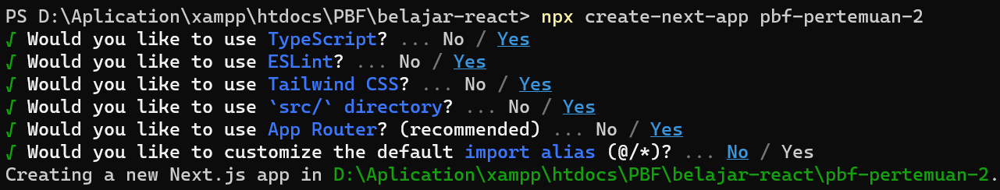

### Langkah 3: Buka dengan VS Code

```bash
cd hello-world

code . 
```

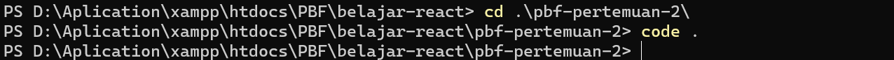

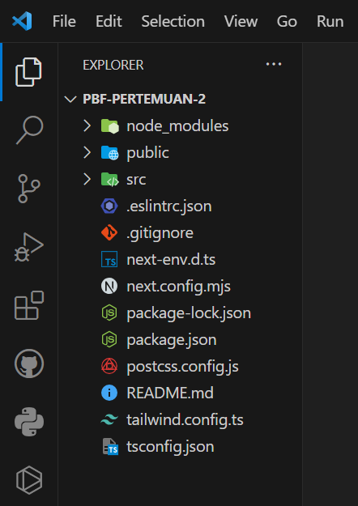

**Soal 2**

***Folder .git***: Folder ini berisi semua informasi yang diperlukan untuk melacak perubahan pada source code project dalam repositori GitHub.

***Folder node_modules***: Folder ini berisi modul Node.js yang digunakan dalam proyek. Modul Node.js adalah paket kode yang dapat digunakan kembali untuk berbagai tugas, seperti membuat permintaan HTTP, mengurai JSON, dan mengelola database.

***Folder public***: Folder ini berisi file statis yang disajikan ke klien website. File statis merupakan file yang tidak perlu diubah oleh server web, seperti gambar, file CSS, dan file JavaScript.

***File .eslintrc.json***: File ini berisi konfigurasi untuk linter ESLint. Sehingga ESLint yang dibahas sebelumnya dapat dilakukan kustomisasi di file ini.

***File .gitignore***: File ini berisi daftar file yang tidak boleh dilacak oleh Git. File-file ini biasanya file yang tidak diperlukan untuk proyek, seperti file temporary atau file konfigurasi lokal. File ini juga membatasi file atau folder apa saja yang tidak akan dipush kedalam repositori GitHub.

***File next.config.mjs***: File ini berisi konfigurasi untuk Framework Next.js.

***File next-env.d.ts***: File ini berisi deklarasi tipe untuk variabel environment Next.js. Deklarasi tipe membantu memastikan bahwa variabel environment digunakan dengan benar.

***File package.json***: File ini berisi informasi tentang proyek, seperti nama, versi, dan dependensi. Dependensi adalah paket kode yang diperlukan oleh proyek untuk berjalan.

***File package-lock.json***: File ini berisi daftar dependensi proyek dan versi spesifiknya. File ini membantu memastikan bahwa semua pengembang yang mengerjakan proyek menggunakan versi dependensi yang sama.

***File postcss.config.js***: File ini berisi konfigurasi untuk PostCSS. PostCSS adalah alat yang memungkinkan memproses dan mengubah file CSS yang digunakan.

***File README.md***: File ini berisi README proyek. README adalah file teks yang berisi informasi tentang proyek.

***File tailwind.config.ts***: File ini berisi konfigurasi untuk Tailwind CSS.

***File tsconfig.json***: File ini berisi konfigurasi untuk TypeScript compiler.

### Langkah 4: Run

```bash
npm run dev
```

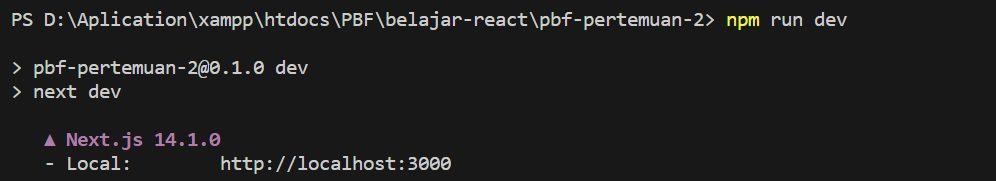

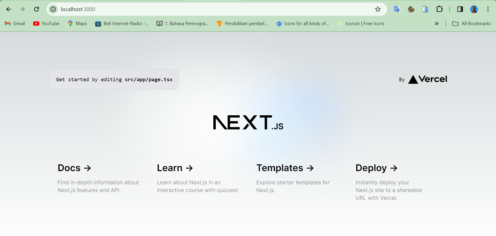

**Soal 3**

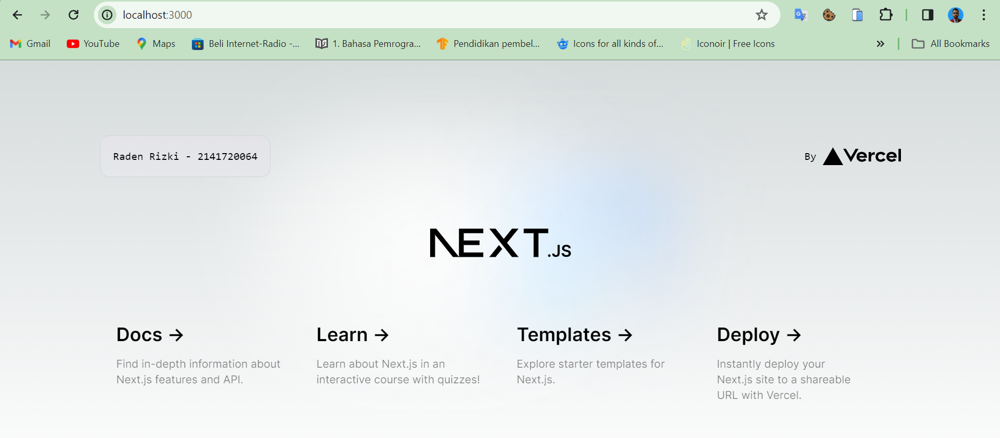

Perubahan dapat langsung terjadi setelah mengedit kode dikarenakan dalam NextJS terdapat fitur Fast Resfresh yang memungkinkan pembaruan tampilan laman tanpa menghilangkan state yang sudah ada.

### Tugas Praktikum

***Remix***

---

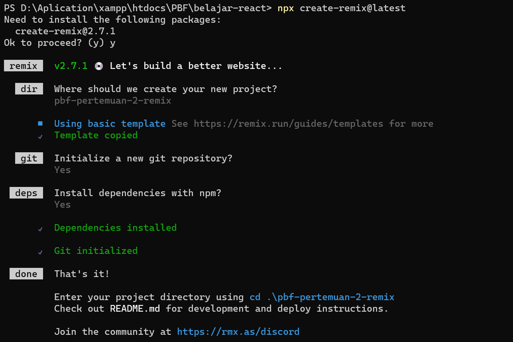

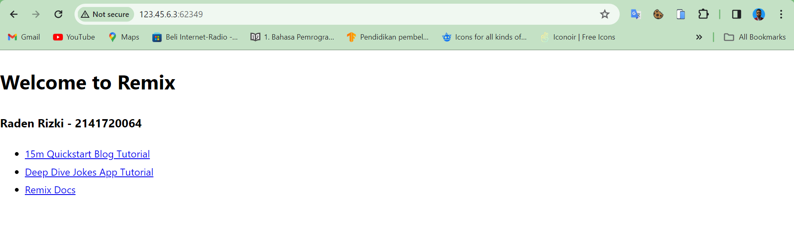

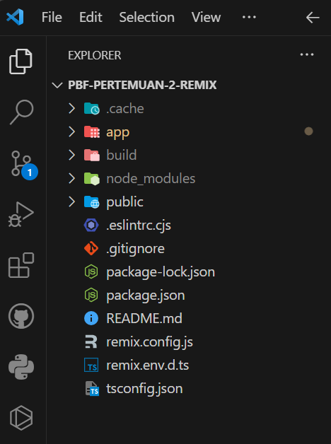

***Gatsby***

---

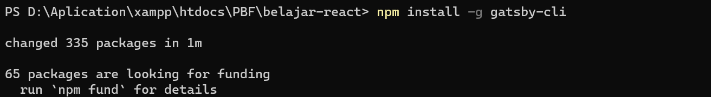

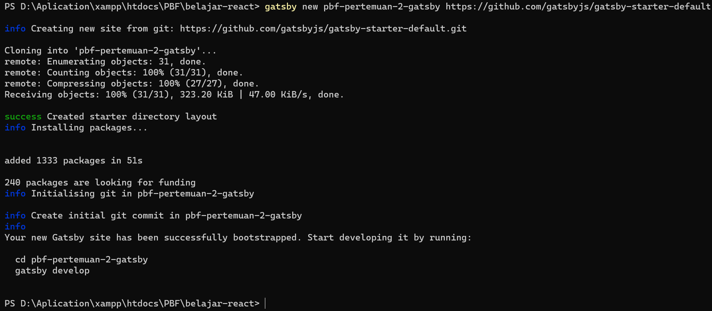

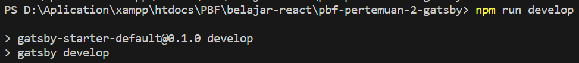

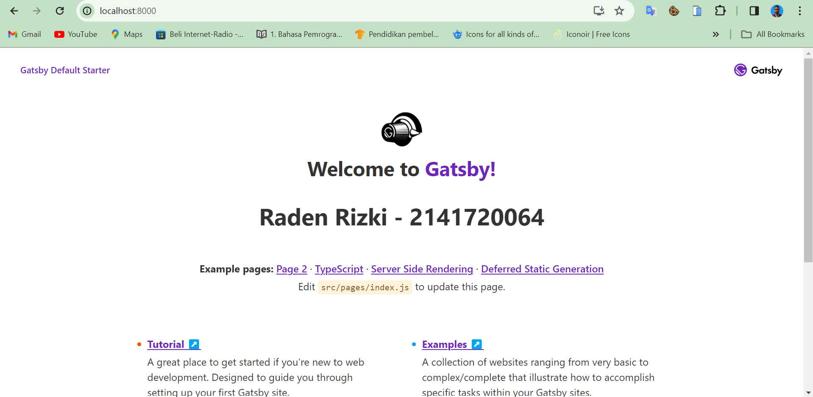

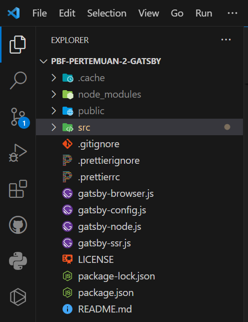

---

Perbedaan dari ketiga framework tersebut yang terlihat jelas adalah struktur folder dan file yang dimiliki oleh masing-masing framework memiliki strukutur yang berbeda, begitupula dengan penamaannya filenya.

Selanjutnya dari pembuatan file index yang berguna untuk laman awal dari website juga memiliki hirarki folder dan file yang berbeda perihal pengelolaan laman, selain hirarki format file juga berbeda, terlebih lagi dari framework gatsby yang berbeda dari lainnya yaitu menggunakan file js untuk lamannya.

Dan terakhir adalah dari hal pembuatan proyek, NextJS lebih mudah dan ringkas dalam pembuatannya sedangkah untuk Gatsby sebaliknya, karena saya mengalami kendala dalam pembuatan proyek Gatsby jika hanya menggunakan gatsby new, sehingga saya menggunakan rute lokasi ke github gatsby sehingga pembuatan proyek dapat berhasil.